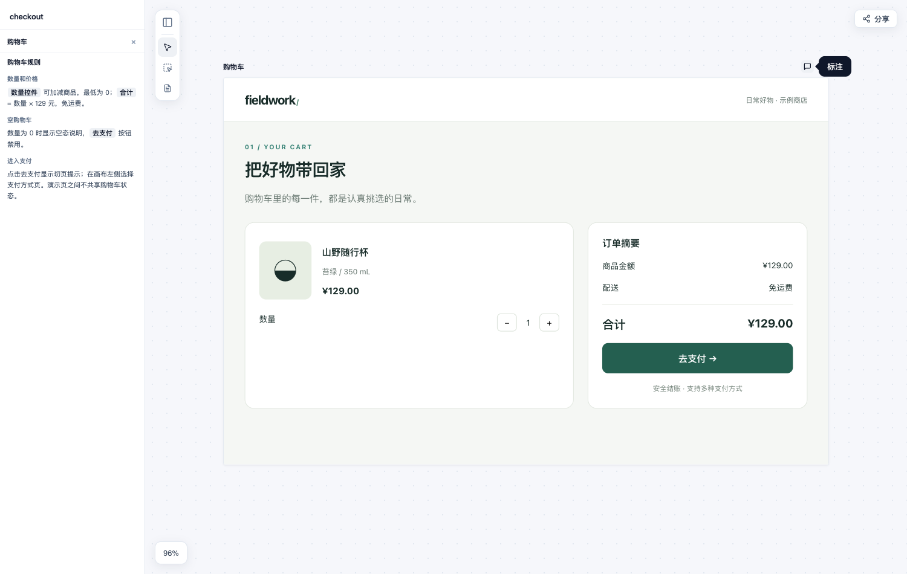
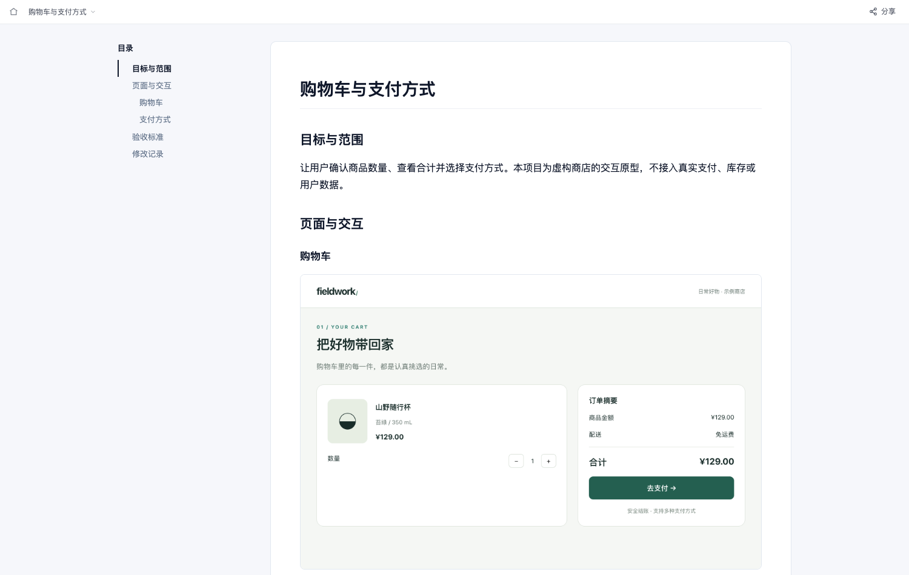
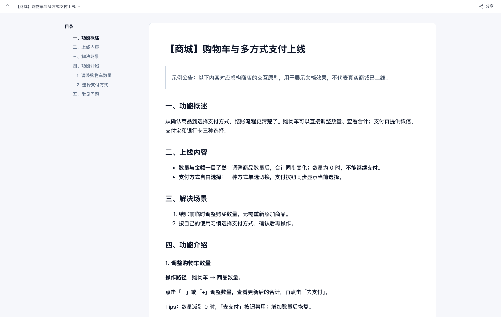

<h1> ProtoFlow</h1>

**描述需求，画出原型，交付 PRD。**

配合 Claude Code、Cursor、Codex 等 AI 助手，用对话制作可交互原型、添加元素标注和生成需求文档。原型改了，还能检查哪些标注和文档需要更新。



[快速开始](#快速开始) · [示例](examples/README.md) · [使用说明](docs/usage.md) · [反馈问题](https://github.com/CharlesYe8848/protoflow/issues)

## 快速开始

### 安装

需要 **Node.js ≥ 22.12.0** 和 Git。

```bash
git clone https://github.com/CharlesYe8848/protoflow.git
cd protoflow
npm ci
```

想先看效果？运行 `npm run demo`，打开终端输出的原型、PRD 和上线公告链接，无需连接 AI。

### 安装场景技能

将仓库中的 [`skills/protoflow`](skills/protoflow/SKILL.md) 文件夹安装到助手的技能目录。
这是 ProtoFlow 唯一的主 Skill，覆盖创建和修改原型、元素标注、交付文档、预览与导出等场景，
让助手能在“做可点击原型”“根据原型整理评审文档”等请求中主动选择 ProtoFlow。
主 Skill 负责场景选择，下面的 MCP 或 CLI 提供实际工具；两者都需要可用。

Codex 用户可在本仓库根目录执行以下命令（自定义 `CODEX_HOME` 时使用对应目录）：

```bash
mkdir -p "${CODEX_HOME:-$HOME/.codex}/skills"
if [ ! -e "${CODEX_HOME:-$HOME/.codex}/skills/protoflow" ]; then
  cp -R skills/protoflow "${CODEX_HOME:-$HOME/.codex}/skills/protoflow"
else
  echo "ProtoFlow 技能已存在，请先比较内容，再决定是否替换。"
fi
```

其他助手通过其技能安装入口添加同一个文件夹。安装后重新打开会话，确认技能目录中出现
`protoflow`。技能不含运行时，也不会自动安装依赖或修改 MCP 配置。

### 连接工具

通过 MCP（让 AI 调用外部工具的接口）接入。选择你使用的助手，将 `/path/to/protoflow` 替换为 ProtoFlow 文件夹的**绝对路径**：

<details>
<summary><strong>Claude Code</strong></summary>

在终端执行：

```bash
claude mcp add protoflow -- node /path/to/protoflow/mcp/server.js
```

</details>

<details>
<summary><strong>Cursor</strong></summary>

在 `~/.cursor/mcp.json` 中添加以下配置；如果已有其他工具，保留它们，把 `protoflow` 加入现有的 `mcpServers`：

```json
{
  "mcpServers": {
    "protoflow": {
      "command": "node",
      "args": ["/path/to/protoflow/mcp/server.js"]
    }
  }
}
```

</details>

<details>
<summary><strong>Codex</strong></summary>

在 `~/.codex/config.toml` 中添加：

```toml
[mcp_servers.protoflow]
command = "node"
args = ["/path/to/protoflow/mcp/server.js"]
```

</details>

配置后重新打开助手会话，确认 ProtoFlow 技能和工具均已加载。
连接诊断与 CLI 备用方式见[使用说明](docs/usage.md#技能与工具连接检查)。

## 试着这样说

**创建原型**

> 做一个可点击演示的购物车结账原型：购物车页展示商品、数量和合计，支付页支持微信、支付宝和银行卡。做好后给我预览链接。

**修改并整理文档**

> 购物车为空时禁用「去支付」。给页面补上交互规则和异常状态标注，再生成一份带截图的 PRD。

**检查后续变更**

> 把商品单价改成 139 元，检查哪些标注和文档需要更新。

打开链接就能试用原型；修改后刷新即可查看。检查会提示需要更新的内容，你可以继续让 AI 核对标注、更新截图并保存新的文档版本。

## 为什么用 ProtoFlow

**原型改了以后，知道哪些标注、文档和已发布内容需要跟着改。**

ProtoFlow 把原型、元素标注、截图和文档关联起来，让一次交付成为可以持续维护的工作流。

| 日常工作 | ProtoFlow 怎么帮你 |
| --- | --- |
| 交互规则散在对话和文档里 | 标注绑定页面元素，点击说明即可定位 |
| 原型修改后，靠记忆核对文档 | 发起检查，发现待核对的标注、过期文档和待更新的已发布内容 |
| 多轮修改后，难以确认交付版本 | 保存 PRD、上线公告的版本、修改记录和发布记录 |
| 换一个 AI 或新会话继续做 | 项目保存在本地文件夹，保留原型、标注和文档供继续编辑 |

适合需要持续修改原型、交付研发并同步业务团队的项目。发布到钉钉等平台需配合相应的 AI 助手工具，详见[使用说明](docs/usage.md)。

## 从原型到交付文档

同一个结账示例，可以整理成面向研发的 PRD，也可以从 PRD 生成面向业务用户的上线公告。

**PRD：页面截图、交互规则、验收标准与修改记录。**



**上线公告：功能价值、操作说明与常见问题。**



[体验完整示例](examples/README.md) · [阅读 PRD 正文](examples/checkout/docs/prd/doc.md) · [阅读上线公告正文](examples/checkout/docs/release-note/doc.md)

## 分享成果

点击画布或文档右上角的「分享」，或直接告诉 AI：

> 把原型导出成一个可直接打开的 HTML 文件，再把 PRD 导出为 Markdown。

画布支持项目 ZIP 和单页 HTML；文档支持 Word、单页 HTML 和带图片的 Markdown 压缩包。
把导出的文件发给同事即可；本地预览链接仅在你的电脑上有效。

## 更多

- [完整示例](examples/README.md)：体验原型、标注、PRD、上线公告和改动检查。
- [使用说明与常见问题](docs/usage.md)：项目保存、截图、系统支持和平台发布。
- [问题反馈](https://github.com/CharlesYe8848/protoflow/issues) · [安全说明](SECURITY.md)

[MIT](LICENSE) · v0.1.0 预览版
