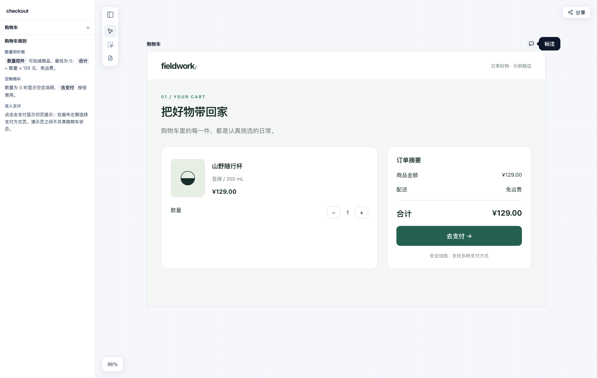
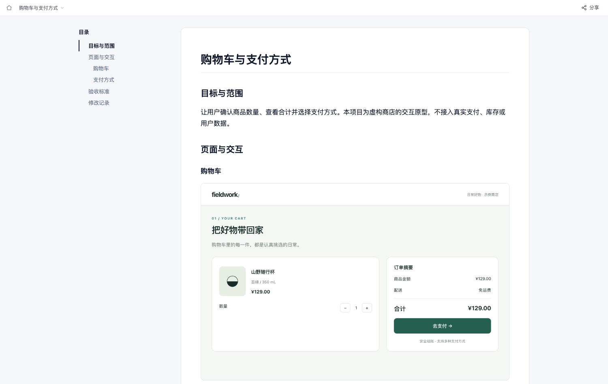
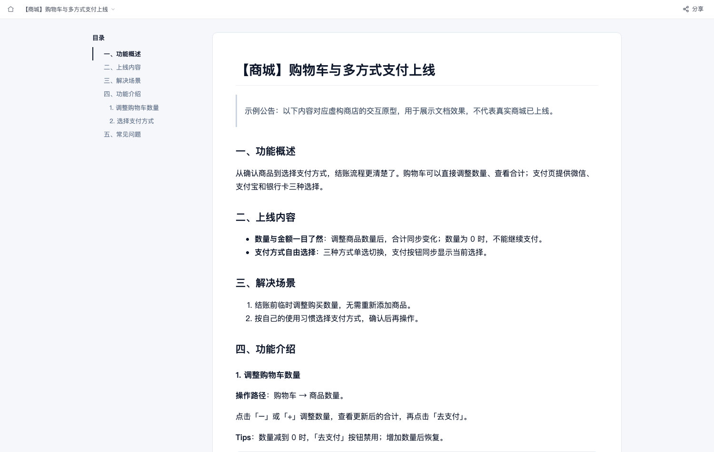

<h1> ProtoFlow</h1>

**描述需求，画出原型，整理数据，交付文档与演示。**

配合 Claude Code、Cursor、Codex 等 AI 助手，用对话制作可交互原型、添加元素标注、生成需求文档、结构化表格和幻灯片。内容改了，还能检查哪些引用和交付物需要更新。



[快速开始](#快速开始) · [示例](examples/README.md) · [使用说明](docs/usage.md) · [反馈问题](https://github.com/CharlesYe8848/protoflow/issues)

## 快速开始

### 安装

需要 **Node.js ≥ 22.12.0** 和 Git。

```bash
git clone https://github.com/CharlesYe8848/protoflow.git
cd protoflow
npm ci
```

想先看效果？运行 `npm run demo`，打开终端输出的原型、PRD 和上线公告链接，无需连接 AI。

### 安装技能

仓库的 [`skills/`](skills/) 下有三个标准 skill，都装到助手的技能目录：

| skill | 作用 |
| --- | --- |
| [`protoflow`](skills/protoflow/SKILL.md) | 入口：让助手在"做可点击原型""做个数据表格"等请求中主动选择 ProtoFlow，并按交付物路由 |
| [`protoflow-product-dev`](skills/protoflow-product-dev/SKILL.md) | 产品研发流程：基于原型写 PRD、上线公告，截原型图、发布前检查、看文档是否落后于原型 |
| [`protoflow-slides`](skills/protoflow-slides/SKILL.md) | 幻灯片创作流程：内容策划、视觉设计、逐页检查，并支持表格、绘图、音视频与多格式导出 |

skill 负责场景选择和流程，下面的 `protoflow` 命令行工具（CLI）提供实际操作；两者都需要可用。

推荐用软链接安装（仓库更新后 skill 跟着更新）。Claude Code 用 `~/.claude/skills`，Codex 用
`${CODEX_HOME:-$HOME/.codex}/skills`；在本仓库根目录执行：

```bash
SKILLS_DIR="$HOME/.claude/skills"   # Codex：SKILLS_DIR="${CODEX_HOME:-$HOME/.codex}/skills"
mkdir -p "$SKILLS_DIR"
for s in protoflow protoflow-product-dev protoflow-slides; do
  if [ -e "$SKILLS_DIR/$s" ]; then echo "$s 已存在，请先比较内容，再决定是否替换。"
  else ln -s "$PWD/skills/$s" "$SKILLS_DIR/$s"; fi
done
```

也可以拷贝（`cp -R`）。拷贝后流程 skill 的脚本不在仓库里，会去 PATH 上找 `protoflow` 命令，或者用
环境变量 `PROTOFLOW_CLI=/path/to/protoflow/bin/protoflow-cli.js` 指定。安装后重新打开会话。技能不含
运行时，也不会自动安装依赖。

### 安装命令行工具

助手通过 `protoflow` 命令操作 ProtoFlow（不需要配置 MCP）。在本仓库根目录执行一次：

```bash
npm link                  # 装一个全局的 protoflow 命令，指向这个仓库（仓库更新后命令跟着更新）
protoflow --selfcheck     # 输出工具数量即安装成功
protoflow --help          # 每个工具一行；protoflow help <工具> 看参数
```

不想装全局命令也可以直接用 `node /path/to/protoflow/bin/protoflow-cli.js`，在跟助手对话时告诉它仓库路径即可。
重新打开助手会话，确认 ProtoFlow 技能已加载。连接诊断见[使用说明](docs/usage.md#技能与工具连接检查)。

## 试着这样说

**先梳理思路**

> 做原型之前，先把会员体系的需求拆成一张脑图，再画一张下单流程图给我看。

打开链接看图，对着节点右键「标注」写意见，复制给 AI 就能接着改。

**创建原型**

> 做一个可点击演示的购物车结账原型：购物车页展示商品、数量和合计，支付页支持微信、支付宝和银行卡。做好后给我预览链接。

**修改并整理文档**

> 购物车为空时禁用「去支付」。给页面补上交互规则和异常状态标注，再生成一份带截图的 PRD。

**检查后续变更**

> 把商品单价改成 139 元，检查哪些标注和文档需要更新。

打开链接就能试用原型；修改后刷新即可查看。检查会提示需要更新的内容，你可以继续让 AI 核对标注、更新截图并保存新的文档版本。

**整理数据并导出 Excel**

> 把这份季度销售数据整理成带汇总和样式的表格，给我预览，确认后导出 Excel。

**制作绘图与幻灯片**

> 先用流程图梳理新用户激活路径，再把关键结论和数据表做成一份评审幻灯片，导出 PDF。

## 为什么用 ProtoFlow

**原型改了以后，知道哪些标注、文档和已发布内容需要跟着改。**

ProtoFlow 把原型、元素标注、截图和文档关联起来，让一次交付成为可以持续维护的工作流。

| 日常工作 | ProtoFlow 怎么帮你 |
| --- | --- |
| 交互规则散在对话和文档里 | 标注绑定页面元素，点击说明即可定位 |
| 原型修改后，靠记忆核对文档 | 发起检查，发现待核对的标注、过期文档和待更新的已发布内容 |
| 多轮修改后，难以确认交付版本 | 保存画布、文档、表格、绘图和幻灯片的不可变版本与修改记录 |
| 换一个 AI 或新会话继续做 | 项目保存在本地文件夹，保留原型、标注和文档供继续编辑 |

适合需要持续修改原型、交付研发并同步业务团队的项目。发布到钉钉等平台需配合相应的 AI 助手工具，详见[使用说明](docs/usage.md)。

## 从原型到交付文档

同一个结账示例，可以整理成面向研发的 PRD，也可以从 PRD 生成面向业务用户的上线公告。

**PRD：页面截图、交互规则、验收标准与修改记录。**



**上线公告：功能价值、操作说明与常见问题。**



[体验完整示例](examples/README.md) · [阅读 PRD 正文](examples/checkout/docs/prd/doc.md) · [阅读上线公告正文](examples/checkout/docs/release-note/doc.md)

## 分享成果

点击画布或文档右上角的「分享」，或直接告诉 AI：

> 把原型导出成一个可直接打开的 HTML 文件，再把 PRD 导出为 Markdown。

画布支持项目 ZIP 和单页 HTML；文档支持 Word、单页 HTML 和带图片的 Markdown 压缩包；表格支持 Excel；绘图支持单页 HTML 和源文件压缩包；幻灯片支持 PDF、MP4、单页 HTML 和源文件压缩包。
把导出的文件发给同事即可；本地预览链接仅在你的电脑上有效。

## 更多

- [完整示例](examples/README.md)：体验原型、标注、PRD、上线公告和改动检查。
- [使用说明与常见问题](docs/usage.md)：项目保存、截图、系统支持和平台发布。
- [问题反馈](https://github.com/CharlesYe8848/protoflow/issues) · [安全说明](SECURITY.md)

[MIT](LICENSE) · v0.2.0 预览版
