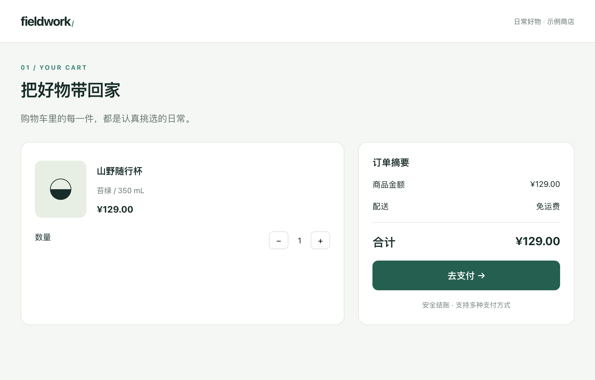
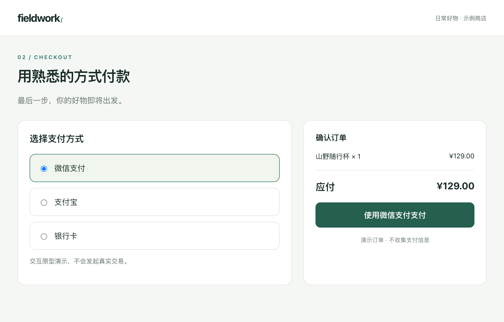

# 购物车与支付方式

## 目标与范围
让用户确认商品数量、查看合计并选择支付方式。本项目为虚构商店的交互原型，不接入真实支付、库存或用户数据。

## 页面与交互

### 购物车

商品单价 129 元，数量从 1 开始，可减到 0。合计为单价乘数量，免运费。数量为 0 时显示空态并禁用「去支付」。点击去支付提示切换画布中的支付方式页。

### 支付方式

默认微信支付，可切换支付宝、银行卡。支付按钮文案跟随选择变化；点击展示模拟成功提示，不发生扣款。为便于独立体验，此页订单固定为一件商品、129 元，不读取购物车页状态。

## 验收标准
- 数量由 1 减至 0 后合计为 0，去支付不可点击；加回 1 后恢复。
- 选择支付宝后按钮显示「使用支付宝支付」。
- 点击支付后显示模拟成功提示。
- 修改画板源码后，chain_status 提示标注待核对与文档截图过期。

## 修改记录
<!-- protoflow:changelog -->
